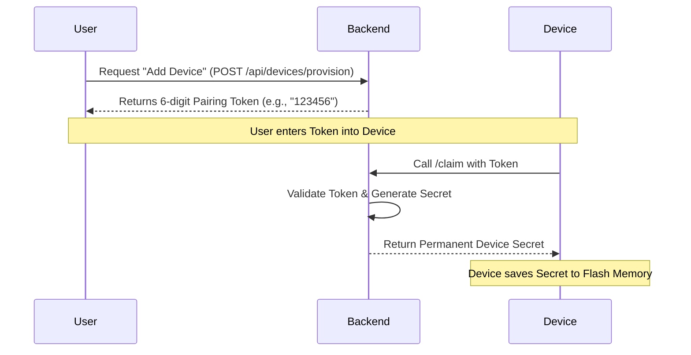

# Hydroponics IoT System - Project Documentation

## 1. System Architecture

The project follows a **Full-Stack MERN Architecture** integrated with an **IoT Layer** (ESP32/MQTT).

### Architecture Diagram

```mermaid
graph TD
    User[User (Browser)] -->|HTTP/React| Frontend[Frontend (Vite + React)]
    Frontend -->|REST API (Axios)| Backend[Backend (Node.js + Express)]

    subgraph "Backend Infrastructure"
        Backend -->|Mongoose| DB[(MongoDB Database)]
        Backend -->|Aedes| MQTT[Internal MQTT Broker]
    end

    subgraph "IoT Layer"
        ESP32[ESP32 Device] -->|MQTT Publish| MQTT
        MQTT -->|Command Subscribe| ESP32
    end

    Backend -->|Ingest Telemetry| DB
    Backend -->|Auth (JWT)| User
```

---

## 2. Project Flow (User Journey)

### Step 1: User Onboarding

1.  **Signup/Login**: User creates an account.
2.  **Company Creation**: A `Company` is automatically created for the user to ensure multi-tenancy (data isolation).

### Step 2: Device Provisioning (Connecting a Device)

This system uses a **Secure Pairing Token** mechanism to bind devices to users without hardcoding credentials.

**Algorithm: Device Claiming Flow**



### Step 3: Monitoring & Control

1.  **Live Monitoring**: Device sends sensor data (pH, TDS) every 5 seconds.
2.  **Visual Analytics**: Frontend fetches historical data and renders charts (Recharts).
3.  **Remote Control**: User clicks "Motor ON" -> Backend publishes MQTT message -> Device receives command.

---

## 3. Key Features & Implementation

### A. Authentication & Security

- **Feature**: Users can only see their own devices. Admin users have a global view.
- **Implementation**:
  - **JWT (JSON Web Tokens)**: Used for stateless session management.
  - **Middleware (`authMiddleware.js`)**: Every request checks if `req.user.company` matches the resource's company.
  - **Password Hashing**: `bcryptjs` ensures passwords are never stored in plain text.

### B. Device Telemetry (Data Collection)

- **Feature**: Real-time graphing of sensor data.
- **Implementation**:
  - **Simulator/ESP32**: Generates data.
  - **Backend Aggregation**: Uses MongoDB Aggregation Framework to group data by day/month for efficient graphing.
  - **Optimization**: Rate limiting prevents device flooding.

### C. Admin Dashboard

- **Feature**: System-wide oversight for super-admins.
- **Implementation**:
  - **Dynamic Graph**: Calculates "Active Users" over selectable periods (7 days, 12 months) using `Date` manipulation in Mongo queries.
  - **Role-Based Access Control (RBAC)**: Only users with `role: 'admin'` can access `/api/admin` routes.

---

## 4. Algorithms for Beginners

### 1. The "Token Exchange" Algorithm (How devices connect)

**Goal**: Connect a device securely.

1.  **Start**: User clicks "Add Device".
2.  **Generate**: Server creates a random code (`123456`) and saves it to DB with `expiry = now + 10 mins`.
3.  **Input**: User types `123456` into the Device setup page.
4.  **Verify**: Device sends `123456` to Server.
    - _If_ Code exists AND is not expired:
      - Server creates a long, complex password (Secret).
      - Server deletes the Code (Single-use).
      - Server gives Password to Device.
    - _Else_: Error "Invalid Code".
5.  **End**: Device is now logged in forever using the Password.

### 2. The "Aggregation" Algorithm (How graphs work)

**Goal**: Show a graph of user activity for the last 7 days.

1.  **Input**: Request for "Last 7 Days".
2.  **Filter**: Select all data where `date >= 7 days ago`.
3.  **Group**: Bucket data by `Day` (e.g., Monday, Tuesday).
4.  **Fill Gaps**:
    - The database only gives days with data (e.g., Mon, Wed).
    - The Code loops from `Today - 7` to `Today`.
    - _If_ data exists for a day, use it.
    - _Else_, insert `0`.
5.  **Output**: A clean list `[Mon: 10, Tue: 0, Wed: 5...]` for the Chart.
