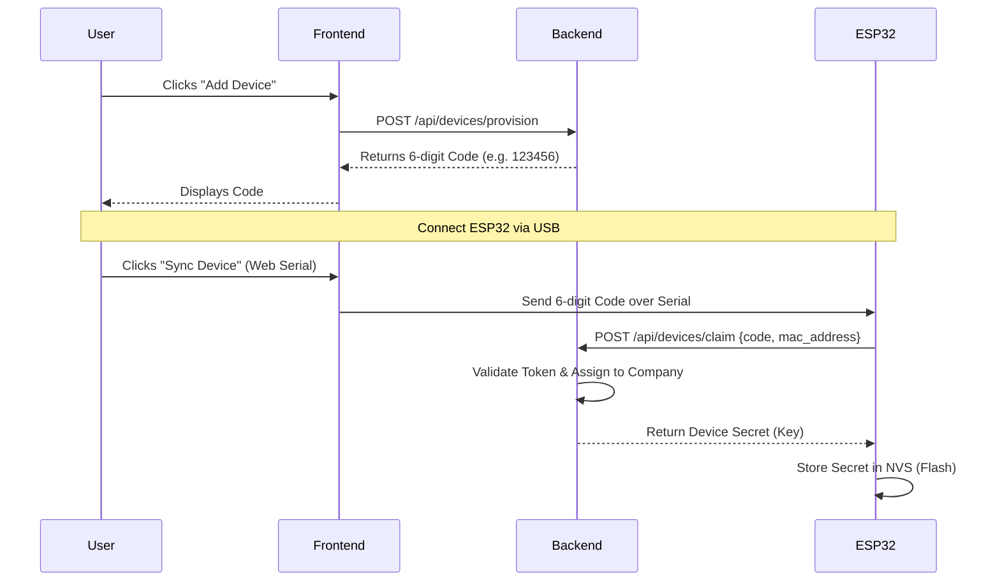
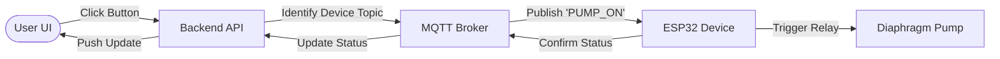
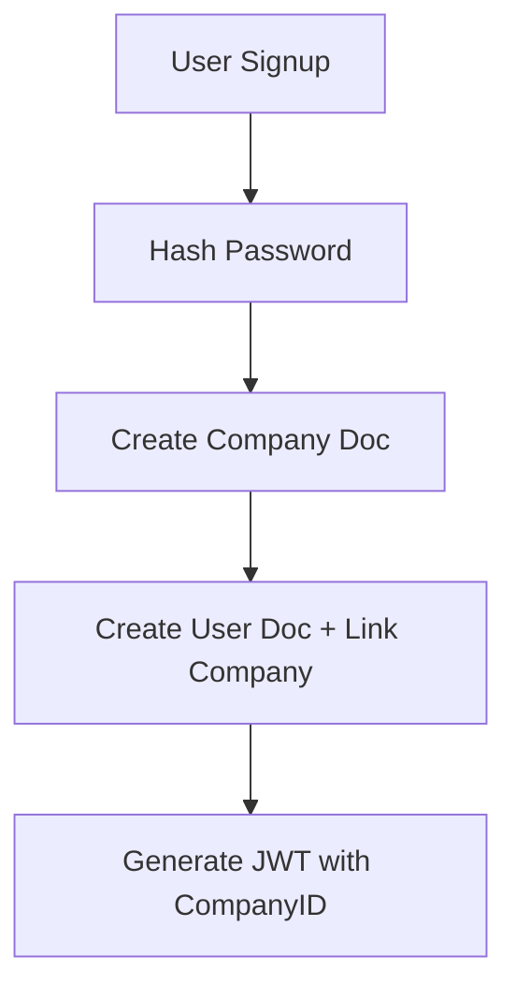
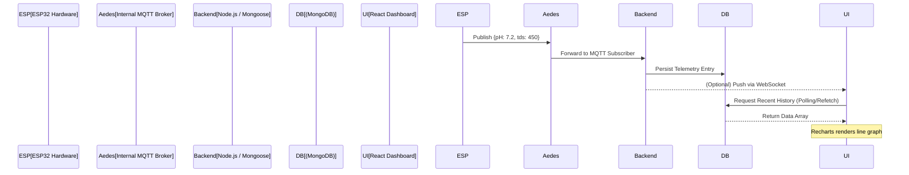
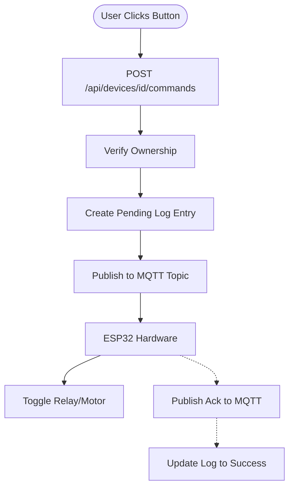
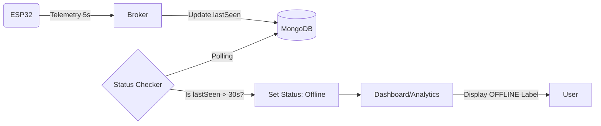
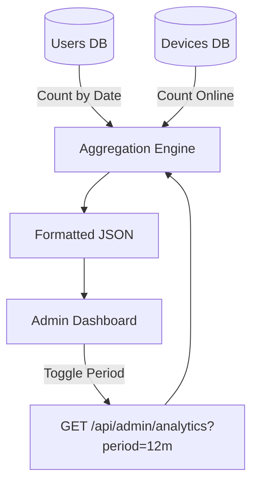

# Hydroponics IoT System - Project Documentation

## 1. System Architecture

The project follows a **Full-Stack MERN Architecture** integrated with an **IoT Layer** (ESP32/MQTT).

### Architecture Diagram

```mermaid
graph TD
    User[User (Browser)] -->|HTTP/React| Frontend[Frontend (Vite + React)]
    Frontend -->|REST API (Axios)| Backend[Backend (Node.js + Express)]

    subgraph "Fluid Layout System"
        Sidebar[Fixed Sidebar 280px]
        Content[Fluid Main Content max-1600px]
        Grid[Responsive Grid min-320px]
    end

    subgraph "Backend Infrastructure"
        Backend -->|Mongoose| DB[(MongoDB Database)]
        Backend -->|Aedes| MQTT[Internal MQTT Broker]
    end

    subgraph "IoT Layer"
        ESP32[ESP32 Device] -->|MQTT Publish| MQTT
        MQTT -->|Command Subscribe| ESP32
    end

    Backend -->|Ingest Telemetry| DB
    Backend -->|Auth (JWT)| User
```

---

## 2. Project Flow (User Journey)

### Step 1: User Onboarding

1.  **Signup/Login**: User creates an account.
2.  **Company Creation**: A `Company` is automatically created for the user to ensure multi-tenancy (data isolation).

### Step 2: Device Provisioning (Connecting a Device)

This system uses a **Secure Pairing Token** mechanism to bind devices to users without hardcoding credentials.

#### 6-Digit Token & USB Handshake Flow



### Step 3: Monitoring & Control

1.  **Live Monitoring**: Device sends sensor data (pH, TDS) every 5 seconds.
2.  **Visual Analytics**: Frontend fetches historical data and renders charts (Recharts).
3.  **Remote Control**: User clicks "Motor ON" -> Backend publishes MQTT message -> Device receives command.

#### Remote Command Control Flow



---

## 3. Key Features & Implementation

### A. Authentication & Multi-Tenancy (Tenant Flow)

- **Feature**: Automatic company isolation.
- **Algorithm: Automatic Company Creation**:
  1.  User submits Signup form.
  2.  Backend `authController` hashes the password.
  3.  Backend creates a new `Company` document (using user's name).
  4.  Backend creates `User` document with `company: NewCompany._id`.
  5.  JWT is generated containing both `userId` and `companyId`.



### B. Real-Time Telemetry (Data Path)

- **Feature**: Sub-second latency for sensor data updates.
- **Algorithm: Data Smoothing & Transmission**:
  1.  **Read**: ESP32 samples pH/TDS sensors 10 times in quick succession.
  2.  **Filter**: Applies a **Moving Average** to remove electrical spikes.
  3.  **Encapsulate**: Packages values into a JSON object with a unique MAC address.
  4.  **Broadcast**: Publishes via MQTT to `telemetry/{deviceId}` with QoS 0 for performance.

#### Telemetry Flow Sequence



### C. Remote Command Engine (Control Flow)

- **Feature**: Trackable command execution with history logs.
- **Algorithm: Command Lifecycle**:
  1.  **Validation**: Backend verifies the User belongs to the Device's Company.
  2.  **Logging**: Create a `commandLog` document with status `pending`.
  3.  **Dispatch**: Publish JSON command to MQTT topic `company/{id}/device/{id}/command`.
  4.  **Acknowledge**: ESP32 receives, toggles PIN, and optionally publishes a "Success" reply.
  5.  **Audit**: Backend updates the Log status to `sent` or `success`.

#### Command Dispatch Flow



### D. Connectivity Monitoring (The "LWT" System)

- **Feature**: Accurate "Offline" status detection even during power loss.
- **Mechanism**:
  1.  **Last Will**: ESP32 registers a "Last Will and Testament" (LWT) message with the broker on connect.
  2.  **Heartbeat**: ESP32 updates its `lastSeen` timestamp in MongoDB every 5 seconds via the telemetry stream.
  3.  **Timeout Logic**: A background middleware on the Backend checks if `Date.now() - lastSeen > 30s`.
  4.  **Automatic Offline**: If timeout occurs, the device is marked `offline` in the DB.



#### E. Density Optimization & Fluid UI

- **Goal**: High information density without sacrificing readability.
- **Implementation**:
  - **Fixed Sidebar**: Standardized at 260-280px for layout stability.
  - **Fluid Container**: Max-width of 1600px ensures the app feels expansive on ultra-wide monitors while remaining centered on standard displays.
  - **Responsive Grid**: Uses `repeat(auto-fill, minmax(320px, 1fr))` to naturally wrap device and plant cards.
  - **Font Normalization**: 0.875rem (14px) base font is used globally for technical clarity.

### D. Admin Global Oversight (Multi-Tenant Analytics)

- **Feature**: Cross-company analytics for system health.
- **Algorithm: Dynamic Period Aggregation**:
  1.  **Filter**: Backend filters users by `createdAt` based on `period` (7d, 12m, 5y).
  2.  **Group**: Uses MongoDB `$dateToString` to bucket users by Day, Month, or Year.
  3.  **Gap Filling**:
      - Since DB only returns buckets with data, the Backend iterates through the date range.
      - If a date is missing from the DB results, it inserts a entry with `count: 0`.
  4.  **Format**: Converts keys like `2024-01-01` into readable labels like `Jan 24`.

#### Admin Data Aggregation Flow



---

## 4. Documentation Strategy

To ensure high performance and premium feel, we utilize:

- **MongoDB Aggregation Framework**: Used in `telemetryController.js` and `adminController.js` to process thousands of entries server-side.
- **Web Serial API**: Enables the "Provisioning" page to talk directly to the ESP32 via Chrome/Edge browsers.
- **Stateful Heartbeats**: Uses a combination of MQTT Last Will and Last Seen timestamps for dual-layer reliability.
- **Aedes Internal Broker**: Removes the dependency on external MQTT services, allowing "One-Click" deployment of the entire stack.
